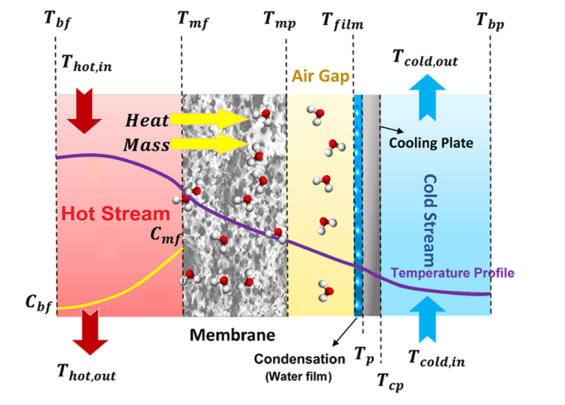

# Intro
Within the framework of the lead project H₂-Mare and its subproject PtX-Wind, the theoretical electrolysis of water and the subsequent synthesis of hydrogen into a chemical energy carrier are being investigated. The overarching objective is to convert the generated hydrogen into a compound that is easier to transport and can later be used either for re-electrification or for industrial purposes. The energy required for the process is to be provided entirely from renewable sources, with the project focusing exclusively on offshore wind power due to its high availability and reliability in the North Sea.

One of the central challenges associated with offshore hydrogen production is the continuous supply of freshwater. Since seawater cannot be fed directly into electrolyzers, appropriate desalination processes must be implemented. For this reason, different desalination technologies are considered within the project. Alongside the state-of-the-art process of reverse osmosis, more recent approaches such as membrane distillation are also evaluated. Particular emphasis is placed on air gap membrane distillation (AGMD) and reverse osmosis, which are not only studied experimentally but are also intended to be represented through mathematical modeling and simulation.

# Goal
The interdependence of the management of water and energy is noted to date but not specifically addressed. While fresh water resources worldwide are already being overexploited, the global (green) energy transition will place additional stress on their recharge ability due to an increased application of PtX technologies. By deriving open-access models for various applications of the green hydrogen value chain, we aim to secure a fast but water-smart and sustainable energy transition.

DECHEMA has bundled various aspects of the energy transition with regard to water management in the [Water-for-X](https://dechema.de/Water_for_X.html) roadmap.

# Air Gap Membrane Destillation (AGMD) 
Membrane distillation (MD) is a thermally driven membrane process in which the separation is based on a vapor pressure difference across the membrane. In contrast to conventional thermal separation processes, which typically require high temperatures close to the boiling point or the application of a vacuum, MD can be operated at moderate feed temperatures in the range of 40 to 90 °C and at atmospheric pressure. One of its key advantages is the nearly complete rejection of salts, with reported separation efficiencies approaching one hundred percent. In the case of air gap membrane distillation, a thin layer of air is located between the membrane and the condensation surface. This air gap reduces the effective heat transfer and therefore improves the energy efficiency of the process. Other configurations, such as direct contact membrane distillation, sweep gas membrane distillation, vacuum membrane distillation or hybrid arrangements, exist as well, but AGMD has been identified as particularly relevant for the offshore desalination application within this project.

[1] 

For the purpose of process analysis, Simulink has been chosen as the simulation environment. The development of the models is still ongoing, and reliable results are not yet available. The long-term objective of this work is to establish modular and scalable models of both AGMD and reverse osmosis in order to assess their respective performance and to compare their suitability for integration into offshore hydrogen production chains as part of the PtX-Wind project

# Files
src/AGMD_model_R2024b.slx (MATLAB/Simulink Ver. 2024b)

# Get in contact:
<a href="mailto:&#119;&#097;&#116;&#101;&#114;&#064;&#100;&#101;&#099;&#104;&#101;&#109;&#097;&#046;&#100;&#101;">Send us a Mail</a>

---

# Source
[1] Sadaf Noamani, Shirin Niroomand, Masoud Rastgar, Mehdi Azhdarzadeh, and Mohtada Sadrzadeh Industrial & Engineering Chemistry Research 2020 59 (50), 21930-21947 DOI: 10.1021/acs.iecr.0c04464

[2] A. Khalifa, D. Lawal, M. Antar, M. Khayet, Experimental and theoretical investigation on water desalination using air gap membrane distillation, Desalination, Volume 376, 2015, Pages 94-108,https://doi.org/10.1016/j.desal.2015.08.016.